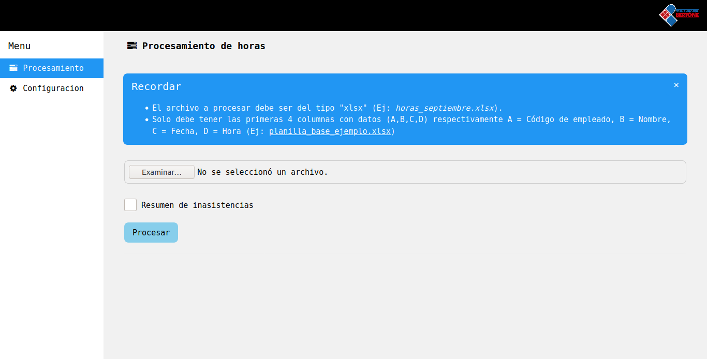

# SPH
### _En desarrollo...._

Una herramienta CLI que autmatiza el desglose de horas trabajadas por el capital humano de una organizacion.

## Prerequisitos
* PHP >= 7.1.0
* Composer

## Empezando
Clonamos el repositorio e instalamos dependencias
```bash
user@user:~$ git clone https://gitlab.com/lucianoldf/sph.git
user@user:~$ cd sph/
user@user:~/sph$ composer install
```

## Uso basico CLI
Para ejecutar:
```bash
user@user:~/sph$ php sph.php
```
SPH buscara en el directorio _./import/_ el archivo _.xlsx_ mas reciente e intentara importarlo y procesarlo. El resultado del proceso se deberia mostrar por la salida estandar y ademas crear un archivo _xlsx_ en el directorio _./export/_

Para obtener mas informacion sobre las posibilidades de opciones
```bash
user@user:~/sph$ php sph.php -h
```

Podemos indicar especificamente que arhicov queremos importar:

```bash
user@user:~/sph$ php sph.php --i-file=./import/planilla_horas_base_2.xlsx
```

Tambien indicando el archivo que se importa y que se exporta:

```bash
user@user:~/sph$ php sph.php --i-file=./import/planilla_input_test_2q_septimebre_2019.xlsx --o-file=./testeo.xlsx
```

## Ejecucion con GUI (WEB)
```bash
user@user:~/sph$ php -S localhost:8000
[Mon Oct 12 19:51:52 2020] PHP 7.4.3 Development Server (http://localhost:8000) started
```
Ingresar al navegador (firefox, chrome, IE, safari, etc...) a la url _localhost:8000_

Deberia verse algo asi:


## Pruebas automaticas
por ahora no hay.... ;)

## Licencia
Este proyecto esta licenciado bajo MIT License - mirar el achivo LICENSE.md para mas detalles

## Agradecimientos
@cztomczak por https://github.com/cztomczak/phpdesktop